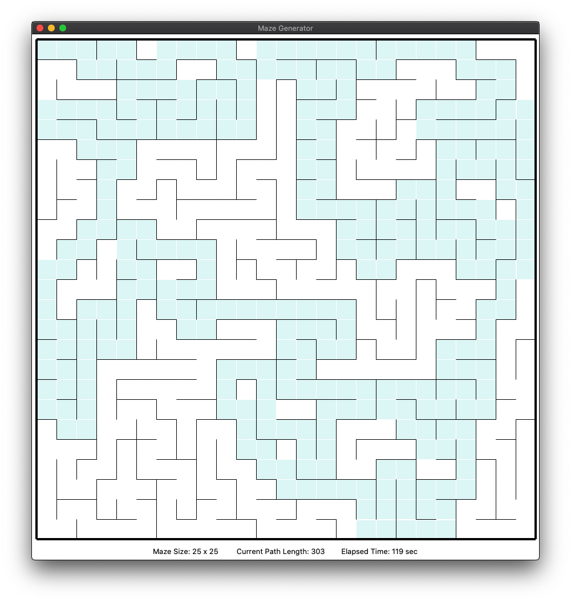

# labyrinth - Python maze generator and solver

This package contains utilities for generating and solving [mazes](https://en.wikipedia.org/wiki/Maze)
using a variety of different algorithms.

## About

Creating mazes by hand has long been a hobby of mine, since I was in elementary school. I always liked
solving mazes ever since I learned what they were, and I eventually realized that they were just as much
fun to make as they were to solve&mdash;if not more so! My dad and I would create mazes for each other,
trying our hardest to create a maze that was too puzzling for the other to solve. We would time ourselves
while solving each other's creations in a constant battle to prove who was the better maze solver. We
never did get a definitive answer to that question, but mazes have been a passion of mine ever since.

My passion for mazes was only further amplified when I discovered one day in a college math class that mazes
are perfect candidates for modeling with the branch of mathematics known as
[graph theory](https://en.wikipedia.org/wiki/Graph_theory). In its most basic form, a *graph* is a set of
objects (known as *vertices* or *nodes*) and a set of pairwise connections between objects (known as *edges*).
Graphs have all kinds of immensely useful practical applications, in areas as diverse as biology, computer
science, and linguistics. In addition to all of these extremely pragmatic applications of graph theory,
graphs can be fun, too&mdash;it turns out that it is possible to generate mazes using several well-known graph
theory algorithms! I have wanted to explore these algorithms and the connection between mazes and graphs ever since,
and this package is the realization of those aspirations.

In order to represent a rectangular maze as a graph, we simply create a vertex for each cell in the maze, and then
we add an edge between any two cells that are neighbors of each other. In this context, only cells directly to the
north, south, east, and west of a given cell are considered neighbors, since you typically aren't allowed to move
diagonally through mazes. Once we have this graph-based representation of the maze grid, generating the maze itself
is exactly equivalent to finding a *spanning tree* of the graph. A *tree* is a special type of graph that is 
*connected* (i.e., there exists a path between any two chosen vertices) and *acyclic* (i.e., there are no looping 
paths). A spanning tree is simply a tree that *spans* (or includes) all vertices of the graph.

The `labyrinth` package uses this graph theory&ndash;based approach to model mazes as a grid of connected cells.
To maintain efficient access to the neighbors of any given cell, the graph is stored using
[adjacency lists](https://en.wikipedia.org/wiki/Adjacency_list). The `labyrinth.graph` module is an
object-oriented implementation of the mathematical concept of graphs as described in the previous paragraph.
This module has no concept of mazes and can be used independently of the rest of this project for any number of
graph-based applications. The only requirement is that the objects being used as vertices must be hashable
(which most Python objects are by default).

## Installation

The package is not currently available on PyPI or any other Python package repository. The easiest
way to install it is to clone the GitHub repository and install it from source.

### Prerequisites

* [Python](https://www.python.org/downloads/) 3.7 or newer
* [Git](https://git-scm.com)
* [Make](https://www.gnu.org/software/make/)

### Installation Instructions

Run the following commands in a shell (a UNIX-like environment is assumed):

```
$ git clone git@github.com:will2dye4/labyrinth.git
$ cd labyrinth
$ make install
```

The package does not have any dependencies besides Python itself. If you wish to
sandbox your installation inside a virtual environment, you may choose to use
[virtualenvwrapper](https://virtualenvwrapper.readthedocs.io/en/latest/) or a similar
utility to do so.

When successfully installed, a program called `maze` and another program called `maze-ui`
will be placed on your `PATH`. See the Usage section below for details about how to use
these programs.

## Usage

The `maze` program is a command-line interface for generating mazes.

At any time, you can use the `-h` or `--help` flags to see a summary of options that
the program accepts.

```
$ maze -h
usage: maze [-h] [-a {dfs,kruskal,prim,wilson}] [-g] [dimensions]

Generate mazes.

positional arguments:
  dimensions            Dimensions of the maze to generate (e.g., 10x10)

optional arguments:
  -h, --help            show this help message and exit
  -a {dfs,kruskal,prim,wilson}, --algorithm {dfs,kruskal,prim,wilson}
                        The algorithm to use to generate the maze
  -g, --gui, --ui       Display a GUI showing the maze being generated
```

Typical usage is `maze <dimensions>`, where `<dimensions>` is a string like `10x10`
describing the dimensions of the maze to generate (width x height). The program will
generate a random maze of the given size and print an ASCII representation of the maze
to the console.

### Algorithms

By default, `maze` will use a random depth-first search algorithm to generate the maze.
To specify a different algorithm, use the `-a` or `--algorithm` flags to `maze`. The
available algorithms are `dfs`, `kruskal`, `prim`, and `wilson`. A description of each
of these algorithms follows.

The **DFS** (depth-first search) algorithm generates paths through the maze using a
conventional [depth-first search](https://en.wikipedia.org/wiki/Depth-first_search)
through the maze's underlying graph. The search starts in the top left corner and 
repeatedly moves to a neighboring cell, creating a path as it goes. When the path reaches 
a dead end (i.e., moving to any neighboring cell would create a cycle), the algorithm 
backtracks to the most recent unvisited cell and starts again. Because of this backtracking
behavior, this algorithm is also sometimes referred to as the **recursive backtrack** algorithm.
The DFS algorithm tends to produce mazes with long, winding corridors but which are not 
particularly difficult to solve.

The version of **Kruskal's** algorithm implemented here is a modified version of
[Kruskal's algorithm](https://en.wikipedia.org/wiki/Kruskal%27s_algorithm) for finding
minimum spanning trees of connected graphs. Because the maze graph is unweighted,
the algorithm is modified to select edges at random rather than based on lowest weight,
but otherwise the algorithm is the same: at each step, an edge between two neighboring
cells is selected, and the walls between the cells are removed if the two cells belong to
disjoint paths through the maze. Kruskal's algorithm tends to produce mazes with many
short cul-de-sacs and dead ends which are moderately difficult to solve.

The version of **Prim's** algorithm implemented here is a modified version of
[Prim's algorithm](https://en.wikipedia.org/wiki/Prim%27s_algorithm), which, like
Kruskal's algorithm, finds minimum spanning trees of connected graphs. As with Kruskal's
algorithm, Prim's algorithm has been modified to select edges at random rather than by
weight. Prim's algorithm starts by selecting a random cell in the graph and marking it as
being part of the maze. It then adds all of that cell's neighbors to a set called the "frontier."
At each subsequent step, a cell is randomly chosen from the set of frontier cells and added to the
maze, and all of that cell's neighbors are added to the set of frontier cells. The process
continues until there are no frontier cells left, meaning that all cells are part of the maze.
Prim's algorithm, like Kruskal's algorithm, tends to produce mazes with many cul-de-sacs and
dead ends.

**Wilson's** algorithm is somewhat similar to Kruskal's and Prim's algorithms, but unlike those
algorithms, Wilson's algorithm generates [uniform spanning trees](https://en.wikipedia.org/wiki/Loop-erased_random_walk#Uniform_spanning_tree)
and therefore tends to produce mazes which are a bit more visually pleasing than those generated
by the previous two algorithms. Wilson's algorithm works by performing repeated loop-erased random
walks through the graph, creating entire passages and adding them to the maze at once. (For more
details about loop-erased random walks and uniform spanning trees, see the Wikipedia link earlier
in this paragraph.)

### Output

When running in non-GUI mode (the default), the `maze` program prints output to the console. Sample
output from running the `maze` program with a custom size is as follows.

```
$ maze 20x10
+---+---+---+---+---+---+---+---+---+---+---+---+---+---+---+---+---+---+---+---+
|               |           |           |       |       |               |       |
+---+---+---+   +---+   +   +---+   +   +   +   +   +   +   +---+   +---+   +   +
|           |           |           |       |   |   |   |   |   |           |   |
+   +---+   +---+---+---+---+---+---+---+---+   +   +   +   +   +---+---+---+   +
|   |                       |       |       |   |   |           |           |   |
+   +   +---+---+---+---+   +   +   +   +---+   +   +---+---+---+   +---+   +   +
|   |   |                   |   |       |       |   |           |   |   |       |
+---+   +---+---+---+---+   +   +   +---+   +---+   +   +---+   +   +   +---+   +
|       |       |       |       |   |       |       |       |       |           |
+   +   +   +   +   +   +   +---+---+   +---+---+---+---+   +---+---+---+---+   +
|   |   |   |       |   |   |       |           |           |               |   |
+   +   +   +---+---+   +---+   +   +---+---+   +   +---+---+   +---+---+   +---+
|   |   |       |   |           |           |   |                       |       |
+   +---+---+   +   +---+---+---+---+   +---+   +---+---+   +---+---+---+   +   +
|           |       |                   |       |       |   |           |   |   |
+   +---+   +---+   +   +   +---+---+---+   +---+   +   +---+   +---+   +   +   +
|   |   |           |   |   |               |       |           |       |   |   |
+   +   +---+---+---+   +---+   +---+---+---+---+   +---+---+---+   +---+---+   +
|                   |                               |                           |
+---+---+---+---+---+---+---+---+---+---+---+---+---+---+---+---+---+---+---+---+
```

#### Exit Codes

When the program runs successfully, it exits with a code of zero (0). If the program
encounters an error in parsing the arguments that were passed to it, it exits with a code
of two (2).

### GUI Mode

In order to visualize the process of generating mazes, the program also has a GUI mode,
which can be activated with the `-g` (`--gui`) flag to `maze`, or by simply invoking `maze-ui`
instead of `maze`. When running in GUI mode, only error output is printed to the console,
and a window will open containing a visual representation of the maze and controls for generating
new mazes using the different algorithms described above. Once a maze has been generated, clicking
and dragging from the top left corner of the maze allows the user to solve the maze if they wish; the
goal is to reach the bottom right corner. While a maze is being generated or solved, the GUI also
displays statistics that show the size of the maze, the length of the current path through the maze,
and how much time has elapsed since the maze was generated (i.e., how long it has taken you to solve it!).

By default, the generation of new mazes will be animated, showing the current path being added to the maze
at each step of the process, but this behavior can be disabled by unchecking the `Animate` box on
the right side of the GUI. When animation is enabled, the `Delay (ms)` slider can also be adjusted
to increase or decrease the delay between steps in the animation. When the `Graph Mode` box is checked,
the conventional grid view of the maze will be replaced by a representation of the graph structure
underlying the maze. This mode can be toggled on and off as desired to compare the traditional visual
representation of the maze to the vertices and edges that the program is actually using to model the maze.

In addition to generating mazes, `maze-ui` is also capable of solving mazes. Once a maze has been
generated, clicking the `Solve` button will show the path through the maze (from the top left corner
to the bottom right corner). If animation is enabled (see above), the drawing of the correct path will
be animated, although the actual process of finding the solution&mdash;which is based on a depth-first
search of a "junction graph" of the maze&mdash;is not animated.

A sample of the program running in GUI mode is shown below.



## References

This project owes a massive debt of gratitude to the
[series of articles on maze generation](https://weblog.jamisbuck.org/2011/2/7/maze-generation-algorithm-recap)
featured on [Jamis Buck's blog](https://weblog.jamisbuck.org). The step-by-step breakdown of various
algorithms, along with simple diagrams and animations showing how the algorithms work, were invaluable in
creating my own adaptations of these algorithms. The 
[article on maze-solving algorithms](https://www.kidscodecs.com/maze-solving-algorithms/) on the website of
[*Beanz* magazine](https://www.kidscodecs.com) also came in handy for understanding the concept of the
"junction graph" and using tree traversal to solve mazes.

In addition to the articles linked to above, I also found the following resources helpful while working
on this project:

* https://en.wikipedia.org/wiki/Maze_generation_algorithm
* https://en.wikipedia.org/wiki/Maze_solving_algorithm
* https://tkdocs.com/shipman/
